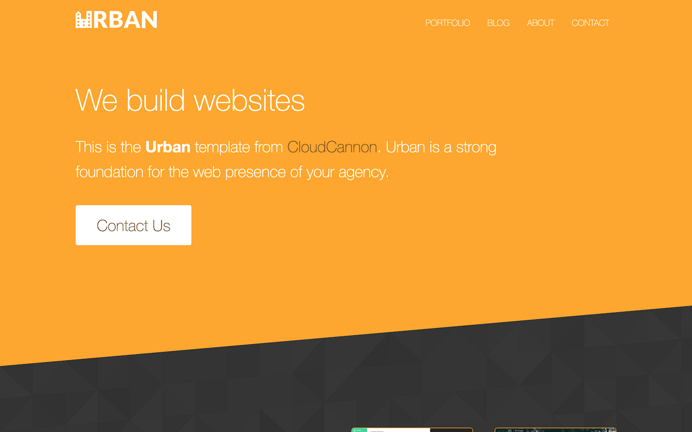

# Fork of Urban Jekyll Template

Adapted by Brian for Benevolent Tek.

It's been many years since I made this repo, so I actually can't remember a lot of things, like why I introduced Gulp
and where I based that off of.

Basically, to get up and running you need homebrew, ruby and node v8.
Update: gem install fails. Have to edit src/build files directly atm.

Hack to get node8 working with OD cli hooks bc asdf fails on node8:
npm i -g n
n 8.17.0
export PATH="/usr/local/n/versions/node/8.17.0/bin/:$PATH"

```
asdf install 2.7.8
sudo gem install bundler -v 2.4.22
bundle install
npm i
gulp serve
```

To deploy on hostinger, notice I added .htaccess and git integration:

```
git commit -a -m "message"
ssh hostinger
cd domains/btek.cc/public_html
git pull

git commit -a -m "message"
rsync _site/ public
git push

# to rsync, rsync -r --exclude "node_modules" --exclude ".history" ./ plesk_btech:bt-jekyll-website

```


# Urban

Web Agency themed business template for Jekyll. Browse through a [live demo](https://teal-worm.cloudvent.net/).
Increase the web presence of your agency with this configurable theme.



Urban was made by [CloudCannon](http://cloudcannon.com/), the Cloud CMS for Jekyll.
Find more templates and themes at [Jekyll Tips](http://jekyll.tips/templates/).

Learn Jekyll with step-by-step tutorials and videos at [Jekyll Tips](http://jekyll.tips/).

## Features

* Contact form
* Pre-built pages
* Pre-styled components
* Blog with pagination
* Post category pages
* Disqus comments for posts
* Staff and author system
* Configurable footer
* Optimised for editing in [CloudCannon](http://cloudcannon.com/)
* RSS/Atom feed
* SEO tags
* Google Analytics

## Setup

1. Add your site and author details in `_config.yml`.
2. Add your Google Analytics and Disqus keys to `_config.yml`.
3. Get a workflow going to see your site's output (with [CloudCannon](https://app.cloudcannon.com/) or Jekyll locally).

## Develop

Urban was built with [Jekyll](http://jekyllrb.com/) version 3.3.1, but should support newer versions as well.

Install the dependencies with [Bundler](http://bundler.io/): `sudo gem install bundler`

~~~bash
$ bundle install
~~~

Run `jekyll` commands through Bundler to ensure you're using the right versions:

~~~bash
$ bundle exec jekyll serve --livereload
~~~

## Editing

Urban is already optimised for adding, updating and removing pages, staff, advice, company details and footer elements in [CloudCannon](https://app.cloudcannon.com/).

### Posts

* Add, update or remove a post in the *Posts* collection.
* The **Staff Author** field links to members in the **Staff** collection.
* Documentation pages are organised in the navigation by category, with URLs based on the path inside the `_docs` folder.
* Change the defaults when new posts are created in `_posts/_defaults.md`.

### Contact Form

* Preconfigured to work with [CloudCannon](https://app.cloudcannon.com/), but easily changed to another provider (e.g. [FormSpree](https://formspree.io/)).
* Sends email to the address listed in company details.

### Staff

* Reused around the site to save multiple editing locations.
* Add `excluded_in_search: true` to any documentation page's front matter to exclude that page in the search results.

### Footer

* Exposed as a data file to give clients better access.
* Set in the *Data* / *Footer* section.

### Company details

* Reused around the site to save multiple editing locations.
* Set in the *Data* / *Company* section.
